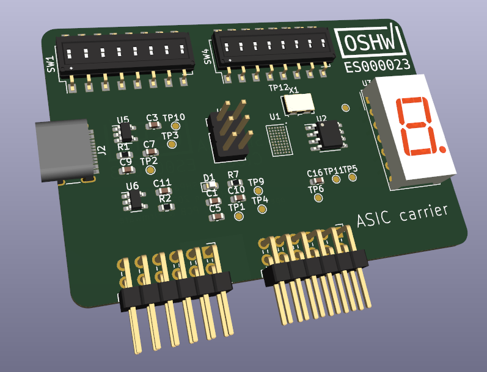

# Tiny Tapeout 02 PCB

Preliminary render

## Spec

* We also have some [ideas on the discord](https://discord.com/channels/1009193568256135208/1011201396659474432).
* Connectors / switches from wuerth
* Lots of testpoints, big ground pads
    * Expose useful signals from ASIC:
        * ready - the sync pulse when the chain is updated
        * slow clock
        * the safety scan chain pins (all those starting with ext_scan...)
    * Expose flash programming on a standard cheap footprint for some common USB FTDI programmer
* Lots of explanatory silkscreen
    * board version and link to this repo on the silkscreen
* USB C PSU, 3.3v and 1.8v
* Adjustable clock / single step
* 9 DIP switch for design select (or jumpers)
* 8 DIP switch for inputs - should last for some fiddling but don’t need to be too heavy duty - could be buttons.
* also need to be able to enable clock divider: set_clk_div 
* 8 LEDs for outputs: 7 segment display inc dot
* Include PMOD headers for IOs, but better if single inline for breadboarding
    * Pluggable into breadboard 
* Flash for firmware used to setup GPIO
* Want to ship everything done - no soldering.
* Done in Kicad for easy contributions
    * all libs and necessary stuff should be in this repo for easy reproducibility
* Should work for TT01 and TT02, only difference is TT02 is QFN and TT01 is WLCSP.
* Physical size - to fit in this box:
    * The white box: https://www.ebay.co.uk/itm/321672513998?var=510575821324
    * External size: 23cm x 16.5cm x 2.2cm (9" x 6.5" x 0.8") - LARGE LETTER QUALIFYING
    * Internal size: 22.5cm x 16cm x 2cm
* Design for test - single sided probe test points, mounting / alignment holes. 
    * Consider how will we validate a small run (less than 300).

## Extras

* Would be nice to have a breakout board with an FPGA on board, so we could test everything before the chips arrive.
* Unpopulated PMOD? for people doing testing on FPGA
* 'Special' clock ? Like an unpopulated SMA that connects to input 0?
* Pi Pico footprint

# Resources

* Omer's breakout https://github.com/omerk/caravel-breakout
* TT02 chip pinout https://github.com/TinyTapeout/tinytapeout-02/blob/tt02/INFO.md#pinout
* Caravel pinout https://caravel-harness.readthedocs.io/en/latest/pinout.html
* Matt's VGA clock board (untested): https://github.com/mattvenn/vga_clock_pcb
* Efabless caravel hardware: https://github.com/efabless/caravel_board
    * QFN breakout https://github.com/efabless/caravel_board/tree/main/hardware/caravel_breakout_QFN
    * WLCSP breakout https://github.com/efabless/caravel_board/tree/main/hardware/caravel_breakout_v2
    * Carrier (optionally fits on top of STM32 Nucleo board) https://github.com/efabless/caravel_board/tree/main/hardware/caravel_Nucleo

# License

[LICENSE](LICENSE)
